<p align="center">
  
</p>

<h1 align="center">optifarm</h1>
<p align="center"><i>Mathematically optimal Minecraft farm layouts.</i></p>

Give it a terrain and a crop; it returns the block placement that maximises
production, and a proof that nothing better exists — via an OR-Tools CP-SAT model.

Implements **sugarcane**, **cactus** and **wheat** — three rules that disagree
about everything (cane needs water *beside* it, cactus needs nothing solid beside
it, wheat needs water *within 4 in every direction*) and share every line of the
core. Adding the next crop is a new rule file and nothing else.

## Results

Two kinds of picture, because there are two honest things to say. On **open,
symmetric ground** a hand pattern is a fair opponent — stripes, checkerboards and
lattices are exactly what a player stamps across an empty field — so the optimum
goes beside one and the comparison means something. On **terrain with obstacles**
there is no pattern to stamp, so there is nothing fair to put beside the optimum;
the picture is just the solver's answer on ground a real farm actually has. Every
layout below is legal and comes straight out of
`examples/generate_readme_images.py` — nothing is posed.

### On open ground, where a pattern is a fair fight

Three crops, three rules, and they disagree about whether this library is worth
running. **Sugarcane** is the one that says yes. Cane needs a water block beside
it, water costs a cell and feeds at most four, so where the water goes is a real
trade — and the 1×2 stripes people build overpay for it:

| Traditional 1×2 pattern | optifarm optimal |
|---|---|
| 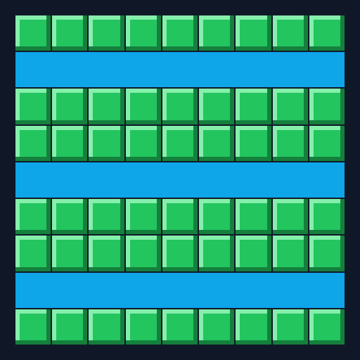 | 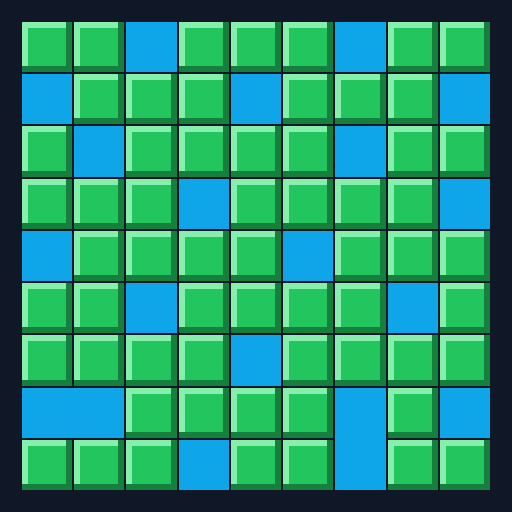 |
| 54 cane · **66.7%** of usable ground | 61 cane · **75.3%** |

66.7% → **75.3%**, **+13.0%**, provably optimal — the stripes pay for a full column
of water where cane only needs a neighbour, and the optimum spends it more
sparingly. (Read even this with care: stripes are not the best a person does. A
player who just digs the water that pays best reaches 70.4%, so the solver's honest
margin is [**+7.0%**](#what-the-comparison-shows), not +13%.)

**Cactus** says no. It forbids neighbours instead of needing them, so the best
layout is a checkerboard — and that is already what everybody builds:

| Checkerboard by hand | optifarm optimal |
|---|---|
| 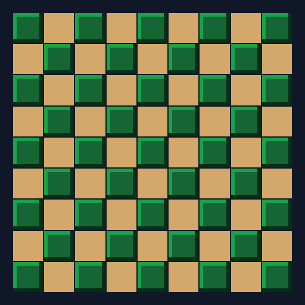 |  |
| 41 cactus · **50.6%** of usable ground | 41 cactus · **50.6%** |

Those two images are the same file — **byte-identical**. One is
`baseline_checkerboard` stamping a pattern, the other is CP-SAT proving nothing
beats 41 on 81 open cells. On an odd-by-odd field the checkerboard is the *unique*
maximum, so there is nothing else to return. **+0.0%**: the search was real, and it
found what you already had.

**Wheat** says no louder. Its water reaches four in every direction — one source
hydrates the 9×9 around it — so water is nearly free and the problem stops being
*where to farm* and becomes *cover the field*:

| 9-lattice by hand | optifarm optimal |
|---|---|
| 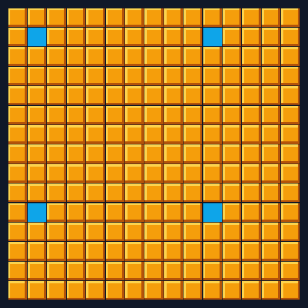 | 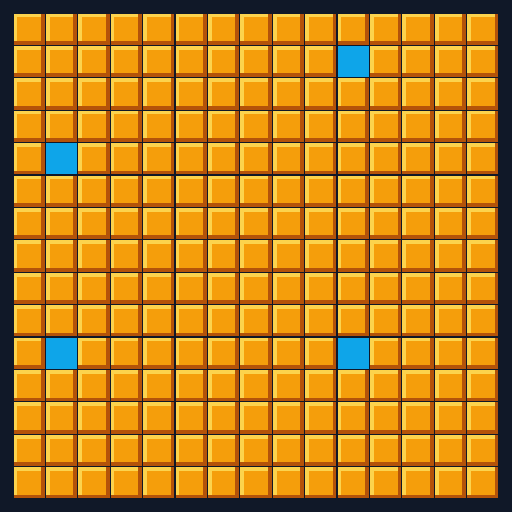 |
| 221 wheat · **98.2%** of usable ground | 221 wheat · **98.2%** |

Another tie — and this time the two layouts are *not* identical. Both place four
sources, in different cells, both optimal: a covering problem with slack has many
best answers, the lattice is one and the solver found another, worth exactly the
same. **+0.0%**, from two pictures that do not even match.

So the honest summary is not "always optimise". For sugarcane the solver buys a few
percent over a thoughtful player; for cactus and wheat, essentially nothing.
[More on why, below.](#what-the-comparison-shows)

### On real terrain, where no pattern fits

A pattern needs open ground. Put a house in the middle of the field, dig a pond, or
make the plot itself round, and there is no stripe or lattice to stamp — you have to
fit the crop to the shape, which is the one job with no template and the job the
solver is actually for. No hand pattern is drawn beside these, because none
applies. The comparison worth making is between the **two crops on identical
ground**, and it is a sharp one: the same terrain grows two completely different
farms.

**A house in the field** — 15×15 with a 5×5 building in the middle:

| Sugarcane (optimal) | Cactus (optimal) |
|---|---|
| 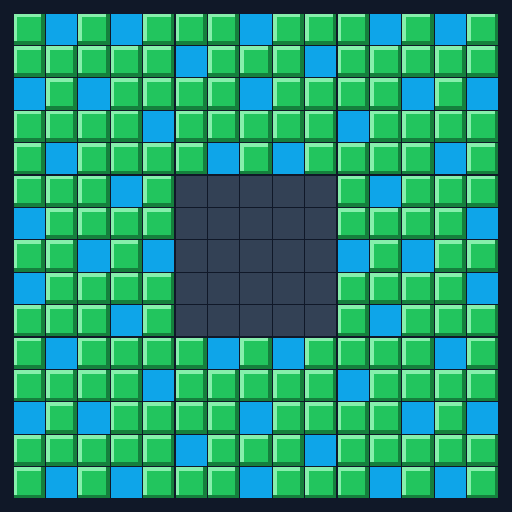 | 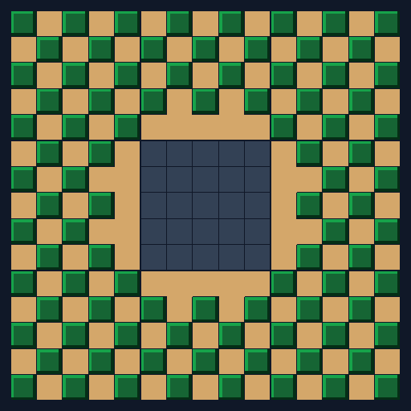 |
| 152 cane · **76.0%** | 92 cactus · **46.0%** |

Sugarcane threads water right up to the walls — an obstacle is just a cell it cannot
use. Cactus keeps a one-block **moat** all the way around the house, the ring of
bare sand you can see hugging it: a wall breaks a cactus exactly as another cactus
would, so nothing may touch it. 76% against 46%, and the gap is almost entirely
that moat.

**A pond** — the same field with a round pool dug out of the centre:

| Sugarcane (optimal) | Cactus (optimal) |
|---|---|
| 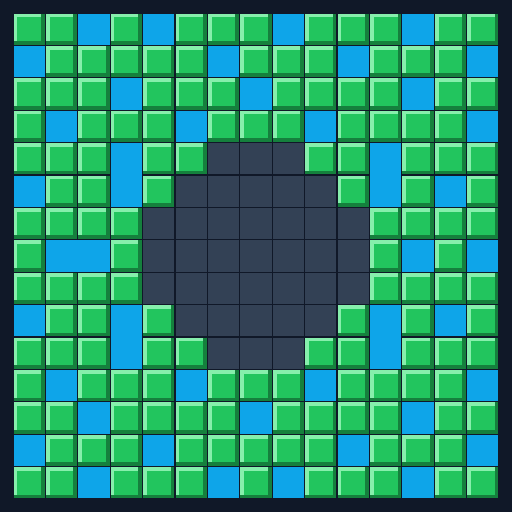 | 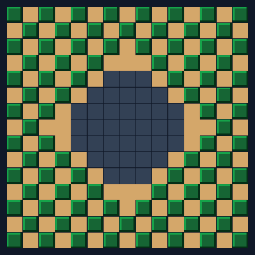 |
| 142 cane · **75.5%** | 88 cactus · **46.8%** |

The round hole costs each crop what its own rule charges — cane loses roughly the
cells the water covers, cactus loses those plus a curved moat around them.

**A round field** — now the plot itself is a circle, walled off outside:

| Sugarcane (optimal) | Cactus (optimal) |
|---|---|
| 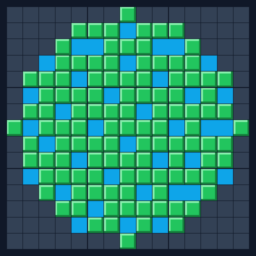 | 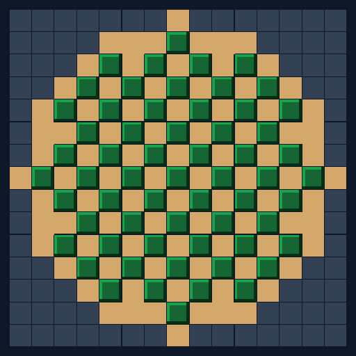 |
| 112 cane · **75.2%** | 61 cactus · **40.9%** |

No rectangular pattern has an edge that follows this boundary; the solver does not
care what shape the free cells make. Cane holds ~75% inside the disc exactly as it
does on a square, and cactus drops to 41% here — lower than on the other two,
because a curved wall is all moat and there is a lot of it.

Look across the three: cane sits at **~75%** whatever the obstacle, cactus in the
**mid-40s**. The terrain moves the raw counts around, but the *rule* sets the
ceiling — and the solver hits it every time, which is the whole difference between a
proof and a pattern.

## Quick start

```bash
python examples/demo_sugarcane.py     # +4-7% over a thinking player. worth it.
python examples/demo_cactus.py        # +4.9% at best. barely.
python examples/demo_wheat.py         # +0.0% on 6 of 7 maps. don't bother.
```

No arguments, nothing to write. Each solves a terrain and shows what the
optimiser bought you over what people build by hand — and for two of the three
crops the honest answer is *almost nothing*, which is the point. Sugarcane first:

```
==================================================================
 Sugarcane on l_shape  (8x10, 68 free, 12 obstacles)
==================================================================

Input  ('.' free, '#' obstacle):
  ......####
  ......####
  ......####
  ..........
  ..........
  ..........
  ..........
  ..........

Checkerboard by hand  ('W' water, 'C' cane, '.' free but unused):
  WCWCWC####
  CWCWCW####
  WCWCWC####
  CWCWCWCWCW
  WCWCWCWCWC
  CWCWCWCWCW
  WCWCWCWCWC
  CWCWCWCWCW

1x2 stripes by hand  ('W' water, 'C' cane, '.' free but unused):
  WWWWWW####
  CCCCCC####
  CCCCCC####
  WWWWWWWWWW
  CCCCCCCCCC
  CCCCCCCCCC
  WWWWWWWWWW
  CCCCCCCCCC

Optimal layout from optifarm  (crop: sugarcane, solver: ilp):
  CWCCWC####
  CWCCCC####
  CCCWCW####
  WCCCCCCWCC
  CCWCWCCCCW
  WCCCCCWCCC
  CCCWCCCCWC
  CWCCCWCCWC

Metrics:
  cane ......... 51
  water ........ 17
  free, unused . 0
  efficiency ... 75.0%  (over 68 free cells, obstacles excluded)
  solver time .. 0.039s
  status ....... optimal

Compared against the hand-built patterns:
  Checkerboard:         34 cane  ( 50.0%)   → optifarm +50.0%
  1x2 stripes:          42 cane  ( 61.8%)   → optifarm +21.4%
  Optimal (optifarm):   51 cane  ( 75.0%)
```

Edit one line at the top of the file (`TERRAIN = "l_shape"`) to try another, or
set `RUN_ALL = True` for the summary across all of them:

```
  Terrain         Free   Checkerboard    1x2 stripes   Greedy water        Optimal   vs greedy
  --------------  ----  -------------  -------------  -------------  -------------  ----------
  rectangle_9x9     81     41 (50.6%)     54 (66.7%)     57 (70.4%)     61 (75.3%)       +7.0%
  l_shape           68     34 (50.0%)     42 (61.8%)     49 (72.1%)     51 (75.0%)       +4.1%
  with_obstacles   112     56 (50.0%)     68 (60.7%)     79 (70.5%)     84 (75.0%)       +6.3%
  ragged            26     13 (50.0%)     14 (53.8%)     18 (69.2%)     18 (69.2%)       +0.0%
  large_15x15      225    113 (50.2%)    150 (66.7%)    164 (72.9%)    172 (76.4%)       +4.9%
```

Read the last column, not the pattern columns. Beating the 1×2 stripes by 13–29%
sounds impressive and is mostly a fact about stripes. **Greedy water** is a player
following no pattern at all, just digging whichever cell buys the most cane — they
beat every pattern here, and against them the exact optimum is worth **4–7%**.
Real, worth having, and a good deal smaller than the headline a template opponent
would have handed us.

Now run `demo_cactus.py` on the same land, and it says the opposite:

```
  Terrain            Free    Checkerboard    Greedy sweep         Optimal   vs check   vs greedy
  ----------------  -----  --------------  --------------  --------------  ---------  ----------
  rectangle_9x9        81      41 (50.6%)      41 (50.6%)      41 (50.6%)      +0.0%       +0.0%
  l_shape              68      31 (45.6%)      31 (45.6%)      31 (45.6%)      +0.0%       +0.0%
  with_obstacles      112      43 (38.4%)      41 (36.6%)      43 (38.4%)      +0.0%       +4.9%
  ragged               26       7 (26.9%)       8 (30.8%)       8 (30.8%)     +14.3%       +0.0%
  large_15x15         225     113 (50.2%)     113 (50.2%)     113 (50.2%)      +0.0%       +0.0%
```

**+0.0%.** For cactus on open ground the checkerboard people already build *is*
the optimum, and the solver only confirms it — that is the pair of identical
pictures [in the Results section](#on-open-ground-where-a-pattern-is-a-fair-fight)
above. Worse: a player with no pattern at all — sweeping the field, planting
wherever it is legal — ties the optimum on four of the five terrains. The exact
solver's best win over that player is **+4.9%, on one map**. (And read `ragged`'s
+14.3% for what it is: one cactus, `8` against `7`, on a 26-cell field where one
cactus *is* 14% of the answer. On a field ten times the size the same margin is a
couple of percent — the count grows with the field, the percentage does not.)

And wheat, the third, closes the case:

```
  Terrain         Free      9-lattice   Greedy water        Optimal   vs latt   vs greedy
  --------------  ----  -------------  -------------  -------------  --------  ----------
  rectangle_9x9     81     80 (98.8%)     80 (98.8%)     80 (98.8%)     +0.0%       +0.0%
  l_shape           68     66 (97.1%)     66 (97.1%)     66 (97.1%)     +0.0%       +0.0%
  with_obstacles   112    108 (96.4%)    108 (96.4%)    108 (96.4%)     +0.0%       +0.0%
  ragged            26     25 (96.2%)     25 (96.2%)     25 (96.2%)     +0.0%       +0.0%
  large_15x15      225    221 (98.2%)    221 (98.2%)    221 (98.2%)     +0.0%       +0.0%
  two_fields       324    320 (98.8%)    320 (98.8%)    320 (98.8%)     +0.0%       +0.0%
  rubble           120    113 (94.2%)    115 (95.8%)    116 (96.7%)     +2.7%       +0.9%
```

So the three crops bracket the answer, and none of the brackets are wide:

| Crop | What the rule is | What the solver is worth |
|------|------------------|--------------------------|
| Sugarcane | a **trade** — water costs 1, feeds 4 | **+4–7%** over a thinking player |
| Cactus | **exclusion** — no two may touch | **+4.9%**, on one map |
| Wheat | **covering** — water costs 1, feeds 80 | **+0.0%** on 6 of 7 maps |

The pattern is not subtle: exact optimisation pays exactly where the rule creates
a real tension between cost and benefit. Sugarcane has one. Cactus barely does.
Wheat has none at all — water is so cheap that the problem stops being an
optimisation and becomes "cover the field", which people are good at. Saying so
is the most useful thing this library does. More on that below.

## What the comparison shows

Every baseline here is a legal layout, steelmanned rather than strawmanned: all 6
stripe variants and both checkerboard colourings are tried and the best reported,
and — the part that is easy to get wrong — each one **fills its leftover holes**.
A pattern that prunes what broke and walks away leaves free production on the
table that a real player would take; beating *that* proves nothing about the
solver and everything about the baseline. (For cactus the fill is worth up to a
cactus per map; for sugarcane it provably never fires, since a cell is only empty
because it has no water beside it, which is exactly what planting would need.)

The other half of a fair fight is picking a real opponent. A *pattern* is not the
best a person can do, so each demo also measures against a player who follows no
pattern at all — and in both cases that player beats every pattern, and shrinks
the solver's margin to single digits. Those are the numbers to judge this by.

The sugarcane patterns still lose, and *why* they lose is worth understanding.

**The checkerboard is safe and wasteful.** Alternating water and cane can never
strand a plant: every cane gets four water neighbours. But cane only needs
**one**, so the pattern pays half the terrain for a guarantee it does not need.
It is pinned near 50% on every terrain above — obstacles barely dent it, because
its correctness is purely local.

**The 1x2 stripes are efficient and brittle.** One water stripe per two rows of
cane is exactly cane's reach, and it lands at 2/3 on open ground — genuinely good.
But it assumes open ground. Drop it on `with_obstacles` and it falls from 66.7%
to 60.7%: a `#` sitting on a stripe strands the cane that stripe was feeding, and
the stripe itself is paid for regardless. The checkerboard, meanwhile, holds 50.0%
— it was never relying on the terrain being tidy.

The stripes are also brittle about *shape*, which is easy to miss and easy to
strawman with. Their period is 3, so they only tile a field whose width is 1 (mod
3). `with_obstacles` is 11 wide for exactly that reason. At 10 the last stripe
falls short and a whole column dies — ten tiles of good ground with no rock near
them — and the solver would post a 30% win that was really a fact about the field
size, not the pattern. Picking the field a pattern was built for is part of giving
it a fair fight.

That trade — safe-but-wasteful against efficient-but-brittle — is the thing a
template cannot escape and a solver never faces. The optimiser holds ~75% on every
terrain. It is not using a cleverer pattern; it is using no pattern at all.

**But neither does a decent player, and that is the honest measurement.** Dig the
water that pays best, repeat: that beats the stripes on every terrain (70–73% vs
56–67%) and lands within 4–7% of proven optimal — dead level with it on `ragged`.
The solver's real prize for sugarcane is those few percent, not the 30% you get by
choosing a template as your opponent.

**And then cactus says the opposite, which matters more.** Cactus forbids
neighbours rather than needing them, so the best layout is a checkerboard — and
that is already what people build. The solver ties it at +0.0% on every regular
terrain. It pulls ahead only where obstacles turn irregular, because a
checkerboard has to commit to one colour of the board *globally* while obstacles
make that choice wrong *locally* — and even that is worth less than the table
makes it look. `ragged`'s **+14.3%** is a single cactus, `8` against `7`, on a
26-cell field where one plant is 14% of everything. The absolute win grows with
area; the percentage does not, because the crop count grows just as fast — so on
any field big enough to matter the margin is a couple of percent, not fourteen.

**And a player who uses no pattern beats the pattern.** Sweeping the field and
planting wherever it is legal commits to nothing, so it adapts to walls that a
checkerboard cannot. That greedy sweep ties the exact optimum on four of five
terrains; the solver's entire advantage over it is +4.9%, once.

So the honest summary is not "always optimise". It is: **for sugarcane the solver
buys a few percent over a thoughtful player; for cactus, almost nothing; for
wheat, nothing at all.** A tool worth trusting is one that will tell you when to
leave it in the drawer, and the demos say that out loud instead of burying a
+0.0% in a table.

Every number above got smaller as the baselines got fairer, and that history is
worth stating plainly:

- The hand patterns did not fill the holes their pruning left, so they threw away
  crop a real player would have planted.
- The cactus demo had a "sparse grid" opponent scoring +64% for the solver. Fill
  its holes and it simply *is* the checkerboard. The +64% was fiction.
- Every demo measured the solver against *patterns*, when a player who follows no
  pattern does better than any of them. That alone cut sugarcane's headline from
  13–29% down to 4–7%, and cactus's from +33% to +0%.
- Wheat's 9-lattice scores 252 on `two_fields` if you stamp it and walk away, and
  320 — the proven optimum — if you repair it the way anyone standing in the field
  would. The unrepaired version would have advertised +27%.
- Cactus's one surviving win, `ragged`'s +14.3%, turned out to be a fact about
  `ragged` being tiny: it is one cactus (`8` vs `7`) on 26 free cells. The count,
  not the percentage, is what a bigger field grows.

None of those were rounding errors; each was the measurement flattering the thing
being measured. A comparison is worth exactly as much as the opponent it picks —
and a percentage is worth exactly as much as the field it was measured on.

See [`examples/README.md`](examples/README.md) for why the demos are split per
crop rather than sharing a `CROP` switch.

## Install

```bash
python -m venv .venv
.venv/Scripts/activate      # Windows;  source .venv/bin/activate on Unix
pip install -e ".[dev]"
```

Requires Python 3.11+ and `ortools`.

## Usage

```python
from mcfarm_opt import optimize, Sugarcane

terrain = """\
........##
....##....
..........
.###......
..........
..........
....##....
.........."""

layout = optimize(terrain, crop=Sugarcane(), solver="ilp")
print(layout.render())
print(layout.metrics)
```

```
CWCWCCWC##
CCCC##CCWC
WCWCCCWCCC
C###WCCCCW
CCWCCCCWCC
WCWCCWCCCC
CCCC##CCWW
CWCWCCWCCC
crop=52 support=19 empty=0 obstacle=9 efficiency=73.2% status=optimal time=0.068s
```

52 sugarcane on 71 usable cells, proven optimal in 68 milliseconds.

### Input and output

Terrain in, layout out — one character per cell.

| Symbol | Input        | Output              |
|--------|--------------|---------------------|
| `.`    | free ground  | free, left unused   |
| `#`    | obstacle     | obstacle (untouched)|
| `W`    | —            | water               |
| `C`    | —            | sugarcane           |

Rows must all be the same length. Blank lines are ignored.

### Metrics

`layout.metrics` carries `n_crop`, `n_support`, `n_empty`, `n_obstacle`, `n_free`,
`n_cells`, `efficiency`, `solve_time` and `status`.

`efficiency` is crop over **free** cells, not over the whole grid — a terrain that
is mostly obstacle should not be scored as a bad farm when the layout used
everything it was given.

### On reproducibility

A terrain usually has many layouts achieving the same optimum. CP-SAT searches in
parallel, so **which** optimal layout you get varies between runs. `n_crop` is
reproducible; the exact rendering is not. Assert on the count, or on the rules the
layout must satisfy — not on a golden picture.

### Large terrains

Pass `time_limit` (seconds) to cap the search. You then get the best layout found
so far, and `metrics.is_optimal` tells you whether it was proven:

```python
layout = optimize(big_terrain, crop=Sugarcane(), time_limit=10.0)
if not layout.metrics.is_optimal:
    print(f"best found so far: {layout.metrics.n_crop} (lower bound)")
```

## The sugarcane model

A cell may hold cane iff it is free, is not itself water, and has **at least one
orthogonally adjacent water block**. Obstacles hold neither water nor cane, and
never satisfy a neighbour's requirement.

As an integer program, with `x[p,b]` = "cell *p* holds block *b*":

```
maximise    sum_p x[p, CROP]

subject to  x[p, CROP] = 1  =>  sum_{q in N(p)} x[q, WATER] >= 1    for all free p
            sum_b x[p, b] = 1                                       for all p
            x[p, OBSTACLE] = 1                                      for all blocked p
```

The plantability rule is an **implication**, not a hard constraint: it fires only
where the solver chose to plant, which is what makes this a choice of where to farm
rather than a demand that all terrain be farmable. "Not itself water" needs no
constraint — the one-hot rule already forbids a cell being two blocks at once.

The tension the solver resolves is that water both enables and consumes cells: each
water block costs one cell of production but can serve up to four neighbours.

Why an exact solver rather than a stamped-out template? On open ground the answer
looks regular, but the counts are not the ones people guess. A 5x5 tops out at
**18** cane, not the 15 that water-every-other-row gives; the optimum spends 7 cells
on water in an irregular pattern. Add obstacles and hand-reasoning degrades fast.

## The cactus model

The mirror image, and the reason the abstraction carries its sign as a parameter.
A cell may hold cactus iff it is free and **no solid block is orthogonally
adjacent**. Cane is drawn to a feature; cactus is repelled by one. In the model
that difference is `minimum=1` versus `maximum=0`.

```
maximise    sum_p x[p, CROP]
subject to  x[p, CROP] = 1  =>  sum_{q in N(p)} (x[q, CROP] + x[q, OBSTACLE]) = 0
```

Stated once per cell, and it needs no mirror: if two adjacent cells both held
cactus, each one's own constraint would already be violated.

**What counts as solid** is the judgement call, and it decides every number. The
grid is a top-down projection, so the question is what sits at the *cactus's own
level* in a neighbouring cell:

- **another cactus** — solid, breaks it.
- **an obstacle** — modelled as solid, so cactus cannot hug it. The terrain
  format has one `#`, so this reads every obstacle as a wall rather than a pit —
  the conservative choice, since a layout valid against a wall is also valid
  against a hole, but not the reverse.
- **sand** — *not* solid at cactus level. The sand a cactus stands on is one block
  **underneath** it, inside the same cell of the projection, never a neighbour.
  This is why `Cactus.support_blocks()` is empty and why real checkerboard cactus
  farms work at all. Note this is deliberately narrower than `BlockType.is_solid`,
  which answers "is sand a solid block?" (yes) rather than "is sand solid *where
  the cactus is*?" (no).

Two consequences worth knowing, both verified:

**Cactus is easy where sugarcane is hard.** This is maximum independent set on a
grid graph. Grid graphs are bipartite, and MIS on a bipartite graph is polynomial
— by König's theorem it is `n - maximum matching` — so the LP relaxation is
integral and CP-SAT closes the proof at the root instead of searching. Sugarcane
cannot prove an 18×18 in 30 seconds; cactus proves a **40×40 in 0.34s**.

**Obstacles are brutal.** A sugarcane obstacle costs about the cell itself. A
cactus obstacle also poisons its up-to-four neighbours, since none may touch it.
On the same 5×5 with six scattered obstacles, sugarcane grows 12 and cactus grows
**2**; in a one-cell-wide corridor, sugarcane grows 5 and cactus grows **0**,
because every free cell touches a wall.

On open ground the answer is the checkerboard everyone already builds —
`ceil(rows*cols/2)`, about 50%, and the solver confirms it rather than discovers
it. The solver earns its keep on irregular terrain, where *which half of the
board* stops being a global choice.

## The wheat model

Structurally identical to sugarcane. Economically nothing like it.

A cell may hold wheat iff it is free, is not water, and has water **within 4
blocks in every direction** — Chebyshev distance, so one source hydrates the 9×9
square around it. Same `AdjacencyRequirement` as sugarcane with two parameters
turned: `DIAGONAL` instead of `ORTHOGONAL`, radius 4 instead of 1.

That small change inverts the economics. Sugarcane is a **trade** — a water block
costs one cell and feeds at most four, so water is expensive and the optimum sits
near 75%. Wheat is a **covering problem** — a water block still costs one cell but
feeds up to eighty, so water is nearly free and the only question is how few
sources cover the field. The optimum runs to about **98%**.

```
CCCCCCCCC     9×9, one source, 80 wheat, 98.8% — proven optimal
CCCCCCCCC
CCCCCCCCC
CCCCCCCCC
CCCCWCCCC
CCCCCCCCC
CCCCCCCCC
CCCCCCCCC
CCCCCCCCC
```

**Hydration ignores what is in the way.** Minecraft checks distance, not line of
sight, so a wall between the water and the farmland shades nothing. That falls out
for free — the rule counts water in the neighbourhood, and an obstacle cannot hold
water. The farmland itself is implicit, exactly as sugarcane's sand is: it sits
*under* the wheat, in the same cell of the projection, so it is never a neighbour.

Wheat is the one crop with a **closed form**. On an open `m × n` rectangle:

```
wheat = m*n - ceil(m/9) * ceil(n/9)
```

The lower bound is a witness argument: take the cells at rows 0, 9, 18, … and
columns 0, 9, 18, … Any two are at Chebyshev distance ≥ 9, and a source only
reaches 4 — so two cells it serves are within 8 of each other, and no source can
serve two witnesses. That forces `ceil(m/9)·ceil(n/9)` sources, and a 9-spaced
lattice achieves it. The bound is tight, which makes it a proof rather than an
estimate — and a far better test oracle than brute force, since wheat's
interesting cases start at 81 cells and `2^81` is not a number.

## Extending: adding a crop

A crop implements `CropRule`. Most crops need no CP-SAT at all — subclass
`AdjacencyCropRule` and declare requirements. The requirement shape carries the
**sign** and the **distance** as parameters, which is what lets one abstraction
cover rules that pull in opposite directions:

`Cactus` is the whole of it — the shipped rule, in full:

```python
class Cactus(AdjacencyCropRule):
    """Cactus, which grows on any cell no solid block touches."""

    @property
    def name(self) -> str:
        return "cactus"

    def support_blocks(self) -> frozenset[BlockType]:
        return frozenset()          # the sand is *under* the cactus, not beside it

    def requirements(self) -> Sequence[AdjacencyRequirement]:
        return (
            AdjacencyRequirement(                       # NEGATIVE adjacency
                blocks=SOLID_AT_CACTUS_LEVEL,           # {CROP, OBSTACLE}
                maximum=0,
            ),
        )
```

That is the entire diff for a crop that pulls in the opposite direction from
sugarcane. No core file was touched to add it.

The three shapes the interface is designed to cover:

| Crop      | Rule                                   | Requirement                                                   |
|-----------|----------------------------------------|---------------------------------------------------------------|
| Sugarcane | needs water orthogonally adjacent      | `AdjacencyRequirement({WATER}, minimum=1)`                     |
| Cactus    | no solid block orthogonally adjacent   | `AdjacencyRequirement({CROP, OBSTACLE}, maximum=0)`            |
| Wheat     | water within 4 in every direction      | `AdjacencyRequirement({WATER}, DIAGONAL, radius=4, minimum=1)` |

All three ship, and all three are one `requirements()` method over the same
unmodified core — the sign, the metric and the radius are parameters, so rules
that pull in opposite directions come out of one abstraction. Nothing about water
or adjacency is hardcoded anywhere below `crops/`: the grid only knows about
distance metrics, and the variables only know about "exactly one block per cell".

For a rule no declarative scheme anticipates, implement `CropRule` directly and
write the constraints by hand — you get the model, the variables and the grid.
`tests/test_extensibility.py::HandWrittenCrop` does exactly this to impose a global
cap that no per-cell rule could express.

## Architecture

```
mcfarm_opt/
├── core/            # crop-agnostic. knows nothing about water.
│   ├── grid.py      #   cells, obstacles, neighbourhoods (Manhattan / Chebyshev)
│   ├── blocks.py    #   BlockType enum + render symbols
│   ├── variables.py #   the x[cell, block] one-hot variables
│   └── result.py    #   FarmLayout + FarmMetrics
├── crops/           # what makes a cell plantable. one module per crop.
│   ├── base.py      #   CropRule protocol + AdjacencyCropRule helper
│   ├── sugarcane.py #   positive adjacency: water within 1, orthogonal
│   ├── cactus.py    #   negative adjacency: nothing solid within 1
│   └── wheat.py     #   radius adjacency:   water within 4, every direction
├── solvers/         # how the model is searched
│   ├── base.py      #   Solver protocol
│   └── ilp.py       #   exact, via CP-SAT
├── io/
│   ├── text.py      # parse / render as text
│   └── svg.py       # render as an image, in the logo's style
└── ...
examples/
├── _shared.py          # terrains + print plumbing. not worth reading.
├── demo_sugarcane.py   # runnable, commented as documentation
├── demo_cactus.py      # ditto, and it argues the opposite case
├── demo_wheat.py       # ditto, and it argues the case most against us
└── generate_readme_images.py   # redraws the Results section above
```

`core/variables.py` is the one module not in the original design sketch. It holds
the `x[cell, block]` variables and the one-hot constraint — the vocabulary the
solver and the crop rules have to share. Putting it in `core` is what keeps crops
from importing solvers or vice versa.

## Tests

```bash
python -m pytest
```

570 tests. The interesting ones are in `tests/test_sugarcane.py::TestAgainstBruteForce`:
they check the CP-SAT model against an **exhaustive enumeration of every possible
water placement**, written in `tests/conftest.py` and sharing no code with the
library. That tests the model against the definition of the problem rather than
against itself.

Every hardcoded optimum in the suite (5x5 → 18, obstacle → 17, L-shape → 15) was
verified the same way — by brute force over all 2^25 water placements, offline,
before being written down.

`tests/test_cactus.py` gets the same treatment, plus a bonus: cactus has a **closed
form**. On open ground the answer is provably `ceil(rows*cols/2)`, so every open
rectangle from 1×1 to 6×6 is checked against arithmetic that owes the solver
nothing. Its brute-force oracle is separate from sugarcane's — same discipline,
different rule.

`tests/test_wheat.py` has to work differently, and ends up stronger for it. Brute
force is exponential and wheat's interesting cases start at 81 free cells, so
enumeration only reaches 1×N strips and toy grids. The real check is the closed
form `m*n - ceil(m/9)*ceil(n/9)`, verified against the solver on every open
rectangle up to 19×19 — arithmetic derived from a witness argument, not from
anything the solver said.

`tests/test_demo.py` guards the demos' headline claims. Every baseline they compare
against is checked to be a **legal** layout under its own crop's rule — using the
same validators that check the solver's own output. A pattern claiming crop it
cannot grow would flatter the hand pattern; over-eager pruning would flatter
optifarm; either way the tables in this README would be a lie that nothing else
would catch. It also asserts the optimum never scores below a baseline (a baseline
is feasible, so it is a lower bound by construction), and it pins the cactus
**+0.0% tie** — that tie is the whole lesson of `demo_cactus.py`, so if it ever
drifts, either the claim or the model is wrong.

## Not yet implemented

- Melons, mushrooms, nether wart (the interface is ready; the rules are not written)
- Heuristic solvers for terrains too large to solve exactly
- PNG export from the library itself — `render_layout_svg` covers the images above,
  and `examples/generate_readme_images.py` rasterises them with whatever browser is
  lying around rather than making the project depend on a renderer
- Schematic export
